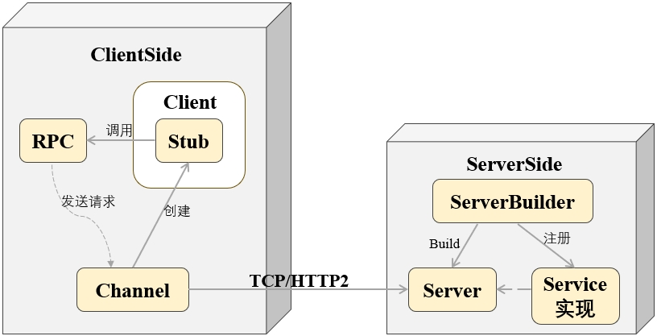
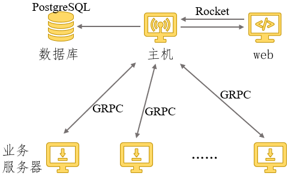
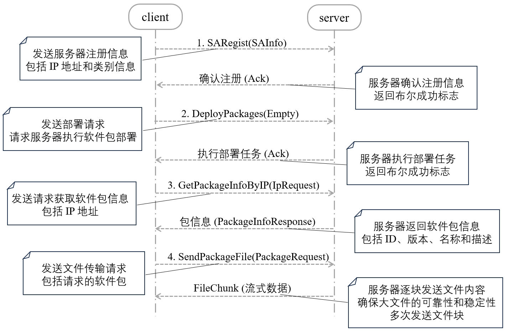

[TOC]

# Linux服务器集群的应用软件自动化部署管理工具

## 一、项目背景

在企业级 IT 环境中，随着业务需求的快速增长和技术架构的复杂化，服务器集群的管理和运维工作变得日益复杂，尤其在大型 Linux 服务器集群中，运维人员需要面对分布式节点的快速扩展和多样化应用软件的管理需求。这些需求包括应用软件的高效安装、版本更新、卸载与同步操作，确保服务的持续可用性与一致性，成为企业运维管理中的重大挑战。

本项目旨在基于 Rust 语言开发一款高效的自动化应用软件部署与管理工具，专为解决企业在 Linux 服务器集群中所面临的自动化运维难题。该工具的设计旨在提升运维效率、降低人为操作带来的风险，确保软件部署的快速、可靠与一致性。项目的具体目标包括：

1. **自动化同步更新与部署**：项目核心功能之一是提供自动化的软件更新与部署能力。通过实时检测集群中不同服务器节点的状态，该工具根据预设的策略与调度计划，自动执行软件的安装、更新或卸载操作。此功能确保各服务器节点上的应用软件版本始终保持同步，避免手动操作带来的不确定性与错误风险，大幅提高软件管理的一致性与操作效率。
2. **多业务场景支持**：该工具设计涵盖多个业务场景，包括 Web 应用、数据库服务、数据处理平台及容器化部署等多种应用场景。根据服务器的分类和业务需求，工具能够智能化选择适当的应用部署策略，灵活应对企业内部不同应用环境的运维挑战，确保服务的稳定性与持续性。
3. **国产操作系统适配**：为响应国内自主可控的 IT 发展需求，本项目针对主流国产操作系统（如麒麟、Ubuntu、CentOS 等）进行了优化与适配，确保该工具能够在这些平台上无缝运行，满足在国产化环境下进行自动化运维的技术要求。项目充分考虑了国产操作系统的兼容性与稳定性需求，助力企业在自主操作系统上实现高效的自动化软件管理。
4. **高扩展性与易维护性**：本项目采用模块化设计，充分利用 Rust 语言在高并发处理、内存安全性和系统性能上的优势，确保工具在大规模服务器集群中的出色表现。工具设计简洁，支持灵活扩展与定制开发，使得企业可以根据具体业务需求扩展功能模块。此外，工具还提供了丰富的日志与监控能力，帮助运维人员快速定位问题，进行精细化的系统调优与故障排查，显著降低了运维成本，增强了系统的可维护性和可操作性。

通过这一工具的实施，企业将能够实现服务器集群运维的全面自动化管理，优化部署流程，提升服务稳定性，并有效降低系统运维工作强度与成本。这一工具不仅适应现有的企业需求，还为未来业务的扩展和创新奠定了坚实的技术基础，确保企业 IT 架构的高效可持续发展。

## 二、关键技术

本项目我采用了以下一系列关键技术和工具，结合各自的优势，实现了企业级 Linux 服务器集群的自动化应用软件部署与管理。以下是每个技术在项目中的具体作用：

1. **Rust 编程语言**：Rust 作为项目的核心开发语言，不仅提供了系统级编程的高效性，还通过其独特的内存安全机制避免了数据竞争和空指针等常见问题。在项目中，Rust 被用于开发主机与业务服务器的通信服务、任务管理模块以及后端的自动化逻辑，确保了高并发环境下系统的稳定性和性能。
2. **gRPC**：gRPC 用于实现主机与各个业务服务器之间的远程过程调用。在项目中，gRPC 负责传递软件部署任务、获取任务执行状态等关键信息。其基于 HTTP/2 的协议支持高效的双向通信，保证了在大规模服务器集群中，通信的可靠性和低延迟，图示如下：



1. **Tonic**：Tonic 是 Rust 中 gRPC 服务的实现库，项目中使用 Tonic 构建了主机与业务服务器之间的通信模块。Tonic 的异步接口与 `tokio` 深度集成，帮助该项目实现了高效的异步网络请求，确保了在进行多台服务器的并行部署时，通信的性能和响应速度不受影响。
2. **Protocol Buffers (Proto)**：Proto 在项目中用于定义主机和业务服务器之间的通信协议和数据格式。通过 Proto，我们能够高效地序列化和反序列化数据，在 gRPC 通信中传递诸如服务器状态、软件版本等关键数据，极大减少了网络传输的负担，提升了通信效率。
3. **tokio**：作为 Rust 的异步运行时库，tokio 支持项目中的大规模并发处理。它在项目中负责处理大量的网络请求和 IO 操作，如同时部署多个业务服务器时的并发任务调度，确保部署任务可以快速、高效地执行，并能够支持高并发的场景。
4. **Rocket**：Rocket 是项目中用于构建 Web 管理平台的核心框架。用户可以通过 Web 界面管理服务器集群中的软件部署任务，Rocket 提供了便捷的 HTTP 请求处理和路由功能，使得用户能够在浏览器上直观地查看服务器状态、创建部署任务，并查看任务执行结果。
5. **PostgreSQL**：项目使用 PostgreSQL 来管理服务器信息、服务器组、部署包以及部署任务等关键数据。在项目中，PostgreSQL 负责存储和追踪每台业务服务器的状态和软件版本，确保在进行软件部署时，可以快速查询和更新服务器的信息，保证部署过程的准确性。
6. **Vue**：Vue 是项目前端框架，用于构建用户管理界面。在项目中，Vue 提供了响应式的数据绑定和动态组件，使用户能够轻松操作并查看服务器集群的状态，配置和管理部署任务。与 Rocket 框架结合，Vue 提供了直观的操作体验，简化了运维人员的工作流程。

通过这些技术的协同工作，项目不仅实现了复杂的自动化部署和管理功能，还确保了系统在高并发和大规模场景下的稳定性和性能。每个技术的引入都有明确的功能定位，推动了整个项目的成功实施。

## 三、框架设计

​	本项目的整体框架设计旨在构建一个基于 **Rust** 语言的自动化应用软件部署与管理工具，专为 Linux 服务器集群的运维自动化而设计，涵盖从服务器管理、软件仓库管理、任务定义到自动化部署执行的全流程。以下是项目的详细框架设计说明：

### 1. 架构概述

项目整体采用 **客户端-服务端** 架构，通过 gRPC 进行主机（管理中心）与各业务服务器节点的通信，实现软件部署任务的调度、分发与执行。同时提供基于 **Rocket** 的 Web 管理平台，用户可以通过浏览器直接管理部署任务。数据库部分使用 **PostgreSQL** 进行服务器、服务器组和软件包信息的持久化存储，前端使用 **Vue** 实现用户友好的操作界面，总体架构图如下：



### 2. 主要组件

项目包含以下核心组件：

#### 2.1 管理中心（主机）

- 功能：管理中心负责定义部署策略和任务，检测各业务服务器的状态，并向业务服务器发送安装、更新或卸载应用的命令。
- 技术实现：
  - **Tonic gRPC 服务端**：管理中心通过 gRPC 与业务服务器通信，接收服务器状态，并根据策略分发部署任务。
  - **Rocket Web 服务**：提供 RESTful API 接口，供 Web 界面与外部系统调用，实现管理操作。
  - **数据库（PostgreSQL）**：存储服务器、服务器组、软件包的元数据及部署任务和部署历史。

#### 2.2 业务服务器节点

- 功能：各个业务服务器节点接收管理中心下发的部署任务，执行应用软件的安装、更新或卸载，并向管理中心报告任务执行状态。
- 技术实现：
  - **Tonic gRPC 客户端**：业务服务器通过 gRPC 接收管理中心的指令，并回传任务执行结果。
  - **本地命令执行模块**：该模块负责调用脚本，执行具体的软件管理操作。

#### 2.3 Web 管理平台

- 功能：为运维人员提供一个友好的 Web 界面，用于查看服务器状态、管理部署包、定义部署任务、监控任务执行状态等。
- 技术实现：
  - **Rocket 框架**：Rust Web 框架，提供 REST API 接口，支持用户管理与操作。
  - **Vue.js 前端框架**：提供响应式用户界面，实现服务器、软件包及部署任务的管理视图。
  - **tonic-web 支持**：通过 `tonic_web::enable` 实现 gRPC-Web 支持，允许 Web 客户端调用 gRPC 服务。

### 3. 功能模块

#### 3.1 服务器管理

- 功能描述：允许用户在 Web 界面或通过 API 添加、删除或编辑服务器信息，并支持对服务器进行分组管理。
- 实现：
  - Web 页面显示服务器的当前状态、所属组及安装的软件版本信息。
  - 后端与 PostgreSQL 数据库交互，实现增删改查操作。

#### 3.2 软件仓库管理

- 功能描述：维护各个应用软件的版本及其下载地址，便于管理中心在部署任务中调用相应的版本进行安装或更新操作。
- 实现：
  - 数据库表用于存储各软件包的元数据信息。
  - Web 界面显示当前仓库中的所有软件包，支持添加、编辑、删除软件包操作。

#### 3.3 任务定义与调度

- 功能描述：允许用户通过 Web 界面或 API 定义部署任务，包括目标服务器（或服务器组）、软件包及部署类型（安装、更新或卸载）。
- 实现：
  - 任务通过管理中心分发给指定的业务服务器，任务完成后回传执行状态。
  - 支持全量部署、按类别或按特定业务服务器进行任务分发。

#### 3.4 自动部署与同步更新

- 功能描述：根据预设策略，自动检测服务器的状态并触发相应的部署操作，确保所有节点的软件版本同步。
- 实现：
  - 通过定期查询数据库中服务器状态与软件版本信息，判断是否需要执行更新操作。
  - 部署过程中，gRPC 服务负责任务的分发和状态的回传，确保部署的可靠性与一致性。

### 4. 模块通信设计

- **gRPC 通信**：管理中心与业务服务器通过 gRPC 通信，业务服务器接收任务并上报状态。gRPC 使用 **Tonic** 实现异步调用，支持高并发场景，减少网络开销。
- **HTTP/REST API**：Web 管理平台与后端通过 REST API 通信，提供对服务器状态、任务定义、部署监控的操作接口。
- **数据库交互**：管理中心与 PostgreSQL 数据库进行交互，存储和读取服务器、软件包及任务等数据。

### 5. 安全性与扩展性

- **安全设计**：采用 HTTPS 进行 Web 平台与 API 的通信加密，gRPC 通信中采用双向 TLS 认证，确保传输安全。
- **扩展性**：项目采用模块化架构设计，各功能模块（如任务管理、服务器管理、软件仓库管理）相互解耦，便于扩展功能或根据企业需求进行定制化开发。

### 6. 日志与监控

- **日志记录**：项目中集成日志系统，记录每次部署任务的执行情况、服务器状态的变更、用户操作日志等，便于运维人员进行问题排查和历史追溯。
- **监控功能**：在 Web 界面提供部署任务的实时监控视图，显示每台服务器的任务执行进度及执行结果。

### 7. 国产操作系统适配

- 项目设计考虑了对国产操作系统（如麒麟、Ubuntu、CentOS）的适配，确保在这些操作系统上能够无缝运行，满足自主可控的要求。

### 8. 开发与运行环境

- **开发语言**：Rust
- **Web 框架**：Rocket
- **前端框架**：Vue.js
- **数据库**：PostgreSQL
- **通信协议**：gRPC, HTTP/RESTful
- **运行环境**：Linux 服务器，兼容主流国产操作系统

## 四、具体实现

本项目使用 **Rust** 语言开发，采用 **Tonic** 库实现基于 **gRPC** 的主机与业务服务器之间的通信。主机作为 gRPC 服务端，各个业务服务器作为客户端，通过 gRPC 进行任务分发和状态反馈，确保集群节点的同步和高效通信。

同时，主机使用 **Rocket** 框架搭建了一个 Web 管理平台，结合 **Vue.js** 提供了用户友好的界面。运维人员可以通过浏览器管理服务器、调度部署任务、并监控任务执行进度，提升了系统的自动化运维效率。

### 1.数据库设计

本项目旨在实现一个自动化应用软件部署与管理系统，数据库设计以支持高效管理企业级 Linux 服务器集群的应用部署需求为目标。数据库的设计重点在于存储和管理服务器、服务器组、部署包及部署任务等核心信息，确保数据的一致性、可扩展性和高效查询性能。

数据库选用 **PostgreSQL** 作为后台存储系统，凭借其对复杂查询、大规模数据管理、多版本并发控制（MVCC）以及丰富的数据类型支持，适用于大规模企业运维环境。

#### 1.1 技术背景

本项目的数据库设计旨在支持以下关键功能：

- **用户管理**：系统用户的注册、登录与认证功能。
- **服务器管理**：管理服务器节点的状态、IP 地址等关键信息，并按服务器组分类。
- **软件包管理**：管理所有可部署的软件包及其版本，提供高效的软件版本控制与部署功能。
- **部署任务管理**：管理任务定义、调度与执行状态的跟踪，确保应用软件在指定服务器或服务器组中的自动化部署。

####  1.2 数据库架构

数据库采用 **关系型模型**，通过外键、唯一性约束及索引确保数据一致性与高效查询。设计中包括以下核心实体：用户（`users`）、服务器（`servers`）、服务器组（`server_groups`）、部署包（`deployment_packages`）和部署任务（`deployment_tasks`）。

##### 1.2.1 表结构设计

###### 1.2.1.1 用户表（`users`）

- 作用：存储系统用户的基本信息，确保用户认证和权限管理。

- 设计：

  ```sql
  CREATE TABLE users (
      id SERIAL PRIMARY KEY,
      username VARCHAR(255) NOT NULL UNIQUE,
      password_hash TEXT NOT NULL,
      created_at TIMESTAMPTZ NOT NULL,
      updated_at TIMESTAMPTZ NOT NULL
  );
  ```

  - `id`: 用户的唯一标识符。
  - `username`: 用户名，唯一且不可为空，确保用户注册时的唯一性。
  - `password_hash`: 密码的哈希值，确保安全存储用户密码。
  - `created_at` 和 `updated_at`: 用户信息创建和更新的时间戳，用于审计和管理。

###### 1.2.1.2 服务器表（`servers`）

- 作用：存储服务器节点的基本信息，如 IP 地址等，便于管理各个服务器的状态。

- 设计：

  ```sql
  CREATE TABLE servers (
      id SERIAL PRIMARY KEY,
      ip_address VARCHAR(15) NOT NULL UNIQUE
  );
  ```

  - `id`: 服务器的唯一标识符。
  - `ip_address`: 服务器的 IP 地址，唯一且不可为空，便于在网络中识别和管理。

###### 1.2.1.3 服务器组表（`server_groups`）

- 作用：对服务器进行逻辑分组，便于批量管理不同的业务或物理区域的服务器。

- 设计：

  ```sql
  CREATE TABLE server_groups (
      id SERIAL PRIMARY KEY,
      description TEXT
  );
  ```

  - `id`: 服务器组的唯一标识符。
  - `description`: 描述服务器组的用途或相关信息，便于理解组的功能。

###### 1.2.1.4 服务器组成员表（`server_group_members`）

- 作用：实现服务器与服务器组之间的一对多关系，记录每个服务器属于哪个服务器组。

- 设计：

  ```sql
  CREATE TABLE server_group_members (
      id SERIAL PRIMARY KEY,
      server_id INT NOT NULL,
      group_id INT NOT NULL,
      FOREIGN KEY (server_id) REFERENCES servers (id) ON DELETE CASCADE,
      FOREIGN KEY (group_id) REFERENCES server_groups (id) ON DELETE CASCADE,
      UNIQUE (server_id, group_id)
  );
  ```

  - `server_id`: 引用 `servers` 表中的服务器 ID。
  - `group_id`: 引用 `server_groups` 表中的服务器组 ID。
  - **约束**：确保同一服务器不会被重复分配到同一服务器组中。

###### 1.2.1.5 部署包表（`deployment_packages`）

- 作用：管理软件包的版本信息、描述及路径，以便准确执行部署任务。

- 设计：

  ```sql
  CREATE TABLE deployment_packages (
      id SERIAL PRIMARY KEY,
      version VARCHAR(50) NOT NULL,
      software_name VARCHAR(100) NOT NULL,
      description TEXT,
      path VARCHAR(255) NOT NULL,
      UNIQUE (software_name, version)
  );
  ```

  - `version`: 软件包的版本号。
  - `software_name`: 软件包名称，唯一且不可为空。
  - `description`: 软件包的描述信息。
  - `path`: 软件包的存储路径，供部署时使用。
  - **唯一性约束**：确保同一软件的不同版本不会重复记录。

###### 1.2.1.6 部署任务表（`deployment_tasks`）

- 作用：记录各个部署任务的执行信息，包括目标服务器或服务器组，任务状态等。

- 设计：

  ```sql
  CREATE TABLE deployment_tasks (
      id SERIAL PRIMARY KEY,
      package_id INT NOT NULL,
      target_type VARCHAR(20) NOT NULL,
      target_id INT,
      is_deployed BOOLEAN DEFAULT FALSE,
      FOREIGN KEY (package_id) REFERENCES deployment_packages (id) ON DELETE CASCADE,
      CHECK (target_type IN ('单台服务器', '服务器组', '所有')),
      UNIQUE (package_id, target_type, target_id)
  );
  ```

  - `package_id`: 外键，指向 `deployment_packages` 表中的软件包。
  - `target_type`: 部署目标类型（单台服务器、服务器组或所有服务器）。
  - `target_id`: 部署目标 ID，根据 `target_type` 的不同，引用 `servers` 表或 `server_groups` 表中的 ID。
  - **唯一性约束**：确保同一部署包不会重复部署到同一目标。
  - **检查约束**：确保 `target_type` 的合法性。

##### 1.2.2 数据表之间的关系

- **`servers`** 与 **`server_groups`**：一对多关系，通过 **`server_group_members`** 实现服务器与服务器组的关联。
- **`deployment_packages`** 与 **`deployment_tasks`**：多对一关系，多个部署任务可以关联到同一个部署包。
- **`deployment_tasks`** 与 **`servers`** 或 **`server_groups`**：多对一关系，根据 `target_type` 确定部署任务的具体目标。


#### 1.3 约束与数据完整性

##### 1.3.1 外键约束

所有涉及到表与表之间关系的字段均设置了 **外键约束**，确保数据引用的完整性。例如，`deployment_tasks` 表中的 `package_id` 外键确保了所有部署任务都与有效的软件包关联。

##### 1.3.2 唯一性约束

关键字段如 `username`、`ip_address` 和 `software_name`+`version` 组合均设置了 **唯一性约束**，防止重复数据的插入，确保数据库的一致性。

##### 1.3.3 检查约束

针对某些特定字段（如 `deployment_tasks` 中的 `target_type`）设置了 **检查约束**，确保字段值合法，防止插入无效数据。

#### 1.4. 性能优化与索引策略

##### 1.4.1 索引设计

为提升查询性能，在高频查询字段（如 `username`、`ip_address`）及外键字段上设置了索引，以加快查询和检索的速度。

##### 1.4.2 批量插入与事务处理

通过 **事务处理** 确保批量操作的原子性，防止数据不一致的情况出现。对于大规模部署任务，使用事务来保证多个任务的创建和执行能够同时完成或回滚。

#### 1.5 安全性与备份机制

##### 1.5.1 数据加密

用户的敏感信息（如 `password_hash`）经过哈希加密存储，避免明文密码暴露的安全风险。

##### 1.5.2 备份与恢复

定期进行 **全量备份** 和 **增量备份**，确保数据库在发生故障时能够快速恢复。同时，日志记录支持数据库的**审计与恢复**操作。

#### 1.6. 数据一致性与高可用性

数据库设计采用了 **MVCC（多版本并发控制）** 机制，确保多个事务并发执行时不会产生数据竞争。同时，通过主从数据库复制技术，提升数据库的高可用性，确保系统在高并发场景下的稳定运行。

### 2. 业务服务器与主机通信设计

在业务服务器上，首先创建了一个 HTTP 客户端，它使用 `hyper` 库提供的功能来处理 HTTP 请求。为了与 gRPC-Web 兼容，客户端配置了一个中间件层 (`GrpcWebClientLayer`)，这使得 HTTP 客户端能够处理 gRPC-Web 的请求和响应。业务服务器通过指定的地址（如 `http://192.168.31.145:3000`）创建了一个 `SAControlClient` 实例，并将其封装在一个 `Arc<Mutex>` 中。这种封装方式使得客户端能够安全地在多线程环境中使用。

主机部分使用 `tonic` 库创建了一个 gRPC 服务，并且通过 `tonic_web` 启用了 gRPC-Web 支持。主机的地址和端口被设置为 `192.168.31.145:3000`。主机通过 `Server::builder` 配置了 HTTP/1.x 支持，以便与 gRPC-Web 兼容。主机初始化并启动了 `SAControlServer`，并开始监听指定的地址。

本项目使用 Protocol Buffers（简称 Proto）来定义 gRPC 的通信协议，版本使用 `proto3` 语法。

下图是服务的通信协议图示，展示了主机与业务服务器之间的交互流程以及消息定义。



#### 2.1服务和消息定义

- **服务定义**：

  SAControl服务包括以下 RPC 方法：

  - `DeployPackages(Empty) returns (Ack)`：用于在服务器端执行部署软件包的操作。客户端调用该方法后，服务器端将根据预定义的规则进行软件包的自动部署。
  - `SARegist(SAInfo) returns (Ack)`：用于在服务器端注册服务器信息。客户端发送服务器的 IP 地址和类别信息，服务器端接收后确认注册。
  - `GetPackageInfoByIP(IpRequest) returns (PackageInfoResponse)`：根据 IP 地址请求获取软件包信息。客户端发送 IP 地址请求，服务器端返回该 IP 地址对应的包信息（如 ID、版本、软件名称和描述）。
  - `SendPackageFile(PackageRequest) returns (stream FileChunk)`：客户端请求软件包文件传输，服务器端通过流式数据传输的方式发送文件块。

- **消息定义**：

  - `Empty`：一个空消息，用于无参数请求。
  - `IpRequest`：包含 IP 地址的请求消息。
  - `SAInfo`：包含服务器 IP 地址和类别的注册信息。
  - `Ack`：一个确认消息，包含布尔类型的成功标志。
  - `ProgramDirectory`：包含程序目录信息，使用名称和子目录列表。
  - `TasksList`：任务列表，包含任务名称的重复字符串。
  - `TaskRequest`：任务请求，包含任务名称列表。
  - `Data`：包含字符串数据的消息。
  - `VersionInfo`：包含版本信息的消息。
  - `PackageRequest`：包含类别信息的请求消息。
  - `FileChunk`：用于文件传输的消息，包含文件内容（字节）和文件类型（字符串）。
  - `PackageInfoResponse`：包含包的 ID、版本、软件名称和描述的响应消息。

#### 2.2主机与业务服务器的交互流程

1. **注册阶段**：业务服务器通过 `SARegist` RPC 方法向主机注册自身信息，包括服务器 IP 和类别信息。主机在接收到此请求后，确认并记录该信息。
2. **部署请求阶段**：业务服务器调用 `DeployPackages` 方法，向主机发送部署请求。主机根据请求指示，执行相应的自动化部署任务。
3. **获取软件包信息**：业务服务器通过 `GetPackageInfoByIP` 方法，按需向主机请求特定 IP 地址的相关软件包信息，主机将返回相应的版本、软件名称等详细信息。
4. **文件传输**：当需要更新或安装新的软件包时，业务服务器使用 `SendPackageFile` 方法请求文件传输。主机通过流的形式逐块发送文件内容（`FileChunk`），确保大文件的传输可靠性和稳定性。

#### 2.3 业务服务器设计

1. **异步获取本地 IP 地址**

   业务服务器需要获取本机的 IP 地址，以便与主机进行通信。通过异步命令执行，业务服务器可以动态获取和确认其 IP 地址，以保证更新任务的精确性。

2. **解析配置文件和 DEB 包的版本号**

   业务服务器检查本地的配置文件和 DEB 软件包以确定当前版本号。

   - 如果配置文件不可用，客户端会回退到默认版本号。
   - 使用外部工具来解析 DEB 包中的版本号信息，以确保获取的版本号准确无误，这一过程有助于减少不必要的更新操作，并保持软件版本的一致性。

3. **gRPC 业务服务器的初始化**

   业务服务器通过 gRPC 接口与主机通信。在初始化过程中，创建了一个基于 HTTP 的 gRPC 客户端，以支持不同服务之间的高效通信，为确保线程安全，业务服务器对象被包装在并发控制结构中，使其能够在异步操作和多线程环境下正确工作。

4. **循环检查版本并触发更新**

   业务服务器采用一个循环结构来不断检查软件包的版本信息。具体流程如下：

   - 向主机发送部署请求，并等待服务器的响应。
   - 根据本地 IP 地址查询主机上对应的软件包信息。
   - 如果从主机获取的软件包信息表明不需要更新，客户端将继续进入下一轮循环。

5. **注册代理信息**

   业务服务器根据获取到的本地 IP 地址和主机返回的信息，向主机进行代理注册。这一步骤确保主机能够识别每个业务服务器，并准确分配相应的更新任务。

6. **比较本地和服务器的版本号**

   业务服务器比较本地版本号与主机上的最新版本号：

   - 如果本地版本落后，业务服务器将进一步检查传输的 DEB 包版本，以确认是否需要更新。
   - 如果传输的版本也低于主机版本，业务服务器会请求获取新的更新包。

7. **请求和保存更新包**

   如果确认需要更新，业务服务器向主机请求更新包，并将接收到的包分块保存到本地文件系统中，根据文件类型（如 DEB 包或安装脚本），业务服务器将内容保存到相应的文件中，确保更新操作的顺利进行。

8. **执行更新操作**

   在接收到完整的更新包后，业务服务器准备执行更新操作。由于之前版本的软件可能用户还正在使用中，所以需要让用户自行决定要不要执行脚本来部署新版本的软件包。

   - 执行脚本

     用户在终端输入以下命令来执行脚本：

     ```bash
     bash install.sh
     ```

9. **定时检查机制**

   业务服务器设置了一个定时机制，在每轮更新检查完成后，等待一段时间再重新开始版本检查。这种设计不仅减少了对主机的频繁请求，还提高了业务服务器的性能和稳定性。

#### 2.4 主机部分设计

主机采用了 Rust 编程语言，使用了 `tonic` 和 `tokio` 等异步编程库，同时集成了 PostgreSQL 数据库进行数据管理。

1. **项目结构**

   服务器端的核心逻辑通过实现 `SaControl` 服务接口来完成，该接口包含了多个方法来处理各种任务，如部署软件包、获取软件包信息、注册传感器代理等。程序模块包括以下内容：

   - **gRPC 服务定义**: `SaControl` 服务接口的定义，包含多个远程过程调用 (RPC) 方法。
   - **配置管理**: 使用结构体和序列化库来管理服务器的配置文件，包括程序目录、任务配置、代理信息等。
   - **数据库连接**: 通过 `tokio_postgres` 库实现与 PostgreSQL 数据库的连接与操作。
   - **文件传输**: 使用异步文件读取和流处理来实现软件包文件的分块传输。

2. **部署包打包**

   为了能够在 Linux 系统上自动化部署软件，需要将应用程序打包成 `.deb` 或 `.rpm` 格式的部署包。这些格式的包通常用于在 Debian/Ubuntu 或 Red Hat/CentOS 系统上进行软件安装和管理。

   - **打包成 `.deb` 文件**

     - **目录结构**：

       ```lua
       package/
       ├── DEBIAN
       │   └── control
       └── usr
           └── local
               └── bin
                   ├── config.toml
                   └── application
       ```

     - **`DEBIAN/control` 文件**：包含包的元数据，如包名、版本、依赖关系等：

       ```less
       Package: package
       Version: 1.0.0
       Section: base
       Priority: optional
       Architecture: all
       Maintainer: Your Name <your.email@example.com>
       Description: A brief description of your package.
       ```

     - **打包命令**：

       ```bash
       dpkg-deb --build package
       ```

   - **打包成 `.rpm` 文件**

     - **目录结构**：

       ```plaintext
       package-name/
       ├── RPM/
       │   ├── BUILD/
       │   ├── RPMS/
       │   ├── SOURCES/
       │   ├── SPECS/
       │   └── SRPMS/
       └── usr/
           └── local/
               └── bin/
                   ├── config.toml
                   └── application
       ```

     - **`SPECS/your-package.spec` 文件**：此文件包含包的构建说明和元数据。

       ```spec
       Name:           package
       Version:        1.0.0
       Release:        1%{?dist}
       Summary:        A brief description of your package.
       
       License:        GPL
       URL:            http://your.url
       Source0:        %{name}-%{version}.tar.gz
       
       %description
       A detailed description of your package.
       
       %prep
       %setup -q
       
       %build
       # 在此处添加编译构建的命令
       
       %install
       # 安装命令，用于将文件复制到 RPM 构建目录
       install -D -m 0755 application %{buildroot}/usr/local/bin/application
       install -D -m 0644 config.toml %{buildroot}/usr/local/bin/config.toml
       
       %files
       /usr/local/bin/application
       /usr/local/bin/config.toml
       ```

     - **打包命令**：

       ```bash
       rpmbuild -ba SPECS/package.spec
       ```

3. **服务接口实现**

   - **部署软件包 (`deploy_packages`)**

     该方法用于根据数据库中的任务列表部署软件包。它从 `deployment_tasks` 表中获取未部署的任务，并根据任务的目标类型执行以下操作：

     - **所有目标**: 如果目标类型为“所有”，则查询所有服务器的 IP 地址并将信息插入到 `package_deployment` 表中。
     - **服务器组**: 对于指定的服务器组，查询组成员的服务器 IP 地址并进行相应的插入操作。
     - **单台服务器**: 针对特定服务器的目标类型，直接查询其 IP 地址并将信息存储在 `package_deployment` 表中。

     部署完成后，更新任务状态为已部署。

   - **获取软件包信息 (`get_package_info_by_ip`)**

     该方法根据客户端提供的 IP 地址，查询指定 IP 所关联的软件包信息。步骤如下：

     1. 从 `package_deployment` 表中查找对应的包 ID。
     2. 根据包 ID 从 `deployment_packages` 表中获取详细信息，如版本、软件名称和描述。
     3. 删除 `package_deployment` 表中与该 IP 相关的记录。
     4. 返回查询到的软件包信息。

     如果查询超时，将返回一个默认的响应，表示查询失败。

   - **传感器代理注册 (`sa_regist`)**

     用于接收来自传感器代理的注册信息，记录并确认接收到的注册信息，包括服务器 IP 和软件包 ID。响应一个成功的确认信息。

   - **发送软件包文件 (`send_package_file`)**

     此方法用于向客户端传输软件包文件。步骤如下：

     1. 根据请求中的包 ID 从数据库中查询软件包的存储路径。
     2. 准备一个文件列表，包括软件包和安装脚本。
     3. 异步读取文件内容，并将其分块发送给客户端。
     4. 返回包含数据流的响应。

4. **数据库操作**

   程序通过 `tokio_postgres` 库与 PostgreSQL 数据库进行交互，包括以下主要操作：

   - **连接和错误处理**: 使用异步任务处理数据库连接，并在发生错误时打印相应的错误信息。
   - **查询操作**: 从 `deployment_tasks`、`servers`、`server_group_members`、`package_deployment` 和 `deployment_packages` 表中查询信息。
   - **插入和更新操作**: 向 `package_deployment` 表中插入新的记录，更新 `deployment_tasks` 表的状态。
   - **删除操作**: 删除与特定 IP 地址相关的包部署记录。

5. **异步任务和错误处理**

   服务器使用 `tokio` 提供的异步功能来处理多任务并发。针对每个数据库操作和文件传输，都进行了详细的错误处理和日志记录，以确保系统的可靠性和可维护性。

6. **启动和配置**

   服务器程序的启动由 `main` 函数负责，其中包括设置服务器的监听地址、初始化日志系统、以及配置 gRPC 服务和 HTTP/1 支持。

   服务器将在指定的 IP 地址和端口上监听客户端请求，并根据定义的服务接口处理请求。

### 3.主机Web 管理平台设计

主机使用 **Rocket** 框架搭建了高效、安全的 Web 管理平台，结合 **Vue.js** 前端框架，为运维人员提供了一个用户友好的操作界面。通过该平台，运维人员可以轻松管理服务器、调度应用软件的部署任务、监控任务执行的实时状态，从而极大提升了系统的自动化运维效率，减少了人为操作带来的风险和复杂度。

该平台采用了 **前后端分离** 的架构设计，前端通过 Vue.js 实现交互页面，后端则由 Rocket 提供 API 服务，配合 **PostgreSQL** 数据库实现数据的持久化和查询。

#### 3.1 后端接口架构

后端使用 **Rocket** 提供 **RESTful API**，负责处理与服务器、服务器组、部署包和任务相关的操作。各模块功能如下：

```shell
├── auth.rs                     // 处理用户认证相关的逻辑，如注册、登录、修改密码
├── deployment_packages.rs      // 处理部署包的增删改查操作，包括添加、更新、删除和获取部署包
├── deployment_tasks.rs         // 处理部署任务的逻辑，包括创建、获取、更新和删除部署任务
├── main.rs                     // 项目入口，配置和启动 Rocket 应用，挂载各路由和中间件
├── model.rs                    // 定义数据库模型、结构体和数据传输对象（DTO），用于数据存储和交换
├── server_group_members.rs     // 处理服务器组成员的操作，如添加服务器到组、从组中移除服务器等
├── server_groups.rs            // 处理服务器组的增删改查操作，包括创建、更新和删除服务器组
└── servers.rs                  // 处理服务器的增删改查操作，包括添加、删除和获取服务器
```

#### 3.2 模块功能说明

- **auth.rs**：负责用户的身份认证与权限管理，包括注册、登录和密码修改等操作，使用 **JWT** 进行认证，确保前后端交互安全。
- **deployment_packages.rs**：管理应用软件的部署包，提供增删改查接口，确保系统能有效管理部署包版本及内容。
- **deployment_tasks.rs**：处理部署任务，支持创建、更新、查询和删除操作，能够实时监控任务执行状态。
- **main.rs**：项目入口，负责 Rocket 应用的配置和启动，挂载各路由和中间件，集成全局日志系统。
- **model.rs**：定义数据库模型，使用 **Diesel ORM** 处理数据库操作，确保数据的持久化和高效查询。
- **server_group_members.rs**：管理服务器与服务器组的多对多关系，提供添加和移除操作，确保服务器组管理的灵活性。
- **server_groups.rs**：负责服务器组的增删改查操作，允许运维人员按组管理服务器，支持批量任务分发。
- **servers.rs**：管理服务器的增删改查，维护服务器的基本信息，包括 IP 地址和状态，支持实时监控。

#### 3.3 前端架构设计

前端使用 **Vue.js** 框架，结合 **Element UI** 组件库，提供响应式的数据绑定和组件化开发模式。通过前端界面，用户可以轻松管理服务器、创建部署任务并监控其执行进度。Vue.js 提供了高效的组件复用能力，确保前端模块结构清晰、易于维护。

**前端文件架构：**

```shell
── src
│   ├── components             // 公共组件目录
│   ├── views                  // 各页面视图组件
│   ├── router                 // 路由管理
│   ├── store                  // 状态管理 (Vuex)
│   └── App.vue                // 根组件
```

主要模块包括：

- **用户认证模块**：
  - 实现用户的登录、注册和密码修改功能，前端使用表单组件与后端 `auth.rs` 接口交互，采用 JWT 令牌机制进行用户认证。
- **服务器管理模块**：
  - 提供服务器列表、服务器状态查看和管理功能，用户可以添加、编辑、删除服务器，前端通过 **Axios** 与 `servers.rs` 接口通信，实时展示服务器的状态。
- **服务器组管理模块**：
  - 支持创建、修改和删除服务器组，允许按组管理服务器集群。前端组件调用 `server_groups.rs` 和 `server_group_members.rs` API 完成服务器组的管理。
- **部署包管理模块**：
  - 允许用户管理应用软件的部署包，包括上传新包、编辑版本、删除旧版本，前端组件通过表单与 `deployment_packages.rs` 进行通信。
- **部署任务管理模块**：
  - 提供部署任务的创建、监控和管理功能，用户可以选择单台服务器或服务器组进行任务分发，实时查看任务的执行进度。前端通过与 `deployment_tasks.rs` 的接口交互，显示任务执行状态。

#### 3.4 系统架构与技术选型

- **Rocket 框架**：作为后端的 Web 框架，提供高性能、安全性和简洁的路由管理，开发人员能够快速构建 Web 服务并与前端无缝对接。
- **Vue.js 前端**：前端使用 **Vue.js**，通过双向数据绑定和组件化设计，确保系统具有良好的用户体验和高效的数据交互。配合 **Element UI**，提供了丰富的 UI 组件，确保用户界面简洁、易用。
- **Axios 和 RESTful API**：前端通过 **Axios** 向后端发送 HTTP 请求，与 Rocket 的 RESTful API 进行交互。每个模块都有清晰的 API 调用，前后端分离，数据通过 JSON 格式传输。

#### 3.5 系统优势

- **模块化设计**：前后端采用模块化设计，后端各模块功能独立，前端通过组件复用和状态管理实现模块解耦，确保系统可扩展性和易维护性。
- **高效通信**：通过 **Tonic gRPC** 实现主机与业务服务器的高效异步通信，保证任务的高效分发和执行。前端通过 RESTful API 和 WebSocket 进行数据实时更新。
- **用户友好**：前端界面简洁直观，用户可以轻松完成复杂的任务调度和管理操作，提供实时反馈和操作提示，提升用户体验。

## 五、集成测试

### 5.1 测试目标

系统集成测试的目标是验证 Web 管理平台中的所有模块能够正确集成并协同工作。通过测试，确保前后端之间的数据传递、API 调用、任务调度、服务器管理、用户认证等关键功能在实际环境中可以无缝运行。具体目标包括：

- 确保后端 API 与前端交互正常，返回的数据符合预期。
- 确保用户认证机制正常工作，用户可以正确登录、访问系统资源。
- 验证主机管理模块和任务调度模块能正常运作，包括业务服务器的增删改查及部署任务的执行状态。
- 测试与数据库的交互，确保数据库的操作能正确处理数据。

### 5.2 集成测试环境

配置集成测试环境包括以下步骤：

- **后端服务**：部署 Rocket 应用服务，集成 PostgreSQL 数据库，并确保与 gRPC 服务的通信正常。
- **前端应用**：确保 Vue.js 应用与后端 API 正常通信，可以通过浏览器访问。
- **数据库**：准备测试数据库，包含模拟数据用于测试不同的场景，保证数据的完整性和一致性。
- **网络环境**：确保测试环境的网络能够支持 WebSocket（如果使用）和 RESTful API 的通信。
- **环境模拟**：准备同一局域网下的多台主机。

### 5.3 测试策略

集成测试采用 **黑盒测试** 和 **白盒测试** 相结合的方式。黑盒测试着重于通过用户界面和 API 模拟用户操作，验证功能输出是否符合预期。白盒测试侧重于对内部模块的交互和接口的有效性进行验证。

### 5.4 具体测试

## 六、使用说明